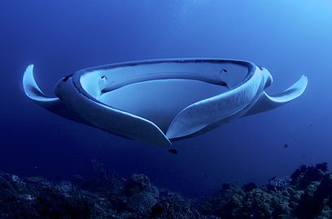

```{r setup, include=FALSE}
knitr::opts_chunk$set(echo = FALSE)
```
*** 

# Description 

La raie manta, aussi appelée diable des mers, fait partie des plus grands animaux de la planette avec prés de 6 mètres d'envergure et presque 2 tonnes. Elle posséde un corps plat étendue avec deux paires de nageoires:

* *Les nageoires pectorales* : Elles sont placées de part et d'autre du corps principal. Celles-c sont font penser à une paire d'aile qui permet à l'animal de nager et se diriger dans l'océan à la manière d'un oiseau dans les aires. 

* *Les nageoires céphaliques* : Ce sont des extentions des nageoires pectorales de chaque côtés de la tête plate. Ces membres sont utilises afin faciliter la progression de l'animal dans l'eau et de lui permettre de nager plus vite. Elle utilise ces membres pour amener l'eau jusqu'aux branchies en la concentrant vers la bouche et également pour se nourrir.

La raie manta est un poisson dit **cartilagineux**, c'est à dire qu'il posséde un squelette en cartilage et donc assez mou. Ses fentes branchiales sont placées en dessous de l'animal sur son ventre et ses yeux sont disposés de chaque côtés de la tête au dessus des nageoires céphaliques. 
Elle posséde une petite queue sans épine et son corps est bleu-gris foncé et blanc (principlement sur le ventre et le bout des ailes).



## Classification: 

Nom scientifique: *Mobula birostrs*

Classification|
----------------|----------------
Régne:          |Animalia
Embranchement:  |Chordata
Classe:         |Chondrichthyes (cartilagineux)
Ordre:          |Myliobatiformes (ordre qui comporte toutes les raies)
Famille:        |**Modibulae** 
Genre:          |**Manta**

## Mode de vie et habitat:

On retrouve les raies mantas principalement dans les **eaux chaudes** des tropiques **au niveau des récifs**, dans les eaux peu profondes. Cependant, au moment de la reproduction, elles peuvent se raprocher tout doucement des côtes. On les retrouve également parfois dans des eaux plus tempérées. Elles peuvent aussi migrer, tout en restant proche de leur habitat, pour trouver deszones où la nourriture y est plus abondante.  

### Alimentation:

Elles se nourrissent principalement de **planctons** et autres micro-organismes ainsi que de petites poissons. Comme cité ci-dessus, la nourriture est dirigé vers la bouche grande ouverte via les nageoires céphaliques.

### Reproduction: 

Lors de la période de reproduction, nous avons que la raie migre au plus proche des côtes afin de trouver un partenaire. 
On note que la raie posséde une rangée de dent qui est utilisé par le mâle pour accrocher la femelle lors de l'accouplement et non pour mastiquer a nourriture. 

Apres la fécondation, la femellle faid des oeufs (géneralement 2) qui resteron à l'intérieur de l'utérus après éclosion et qui se nourriront de leur réserve d'énergie: le vitellus. L'animal est donc **ovivipare**. La période de gestation est d'environ 1 an et une fois bien développé, les petits sont relachés dans l'océan, ils ont alors plusieurs kilos et mesurent prés d'un mètre. La maturité sexuelle d'un individu arrive après près de 15 ans et on a, en moyenne, une naissance tous les 5 ou 6 ans. 

Aujourd'hui on sait que la raie manta **peut vivre jusqiu'à 50 ans**.


Note supplémentaire: La raie possède des électrorécepteurs qui leur permettent de s'orienter, de trouver leur proie et leur partenaire potentiel. 


