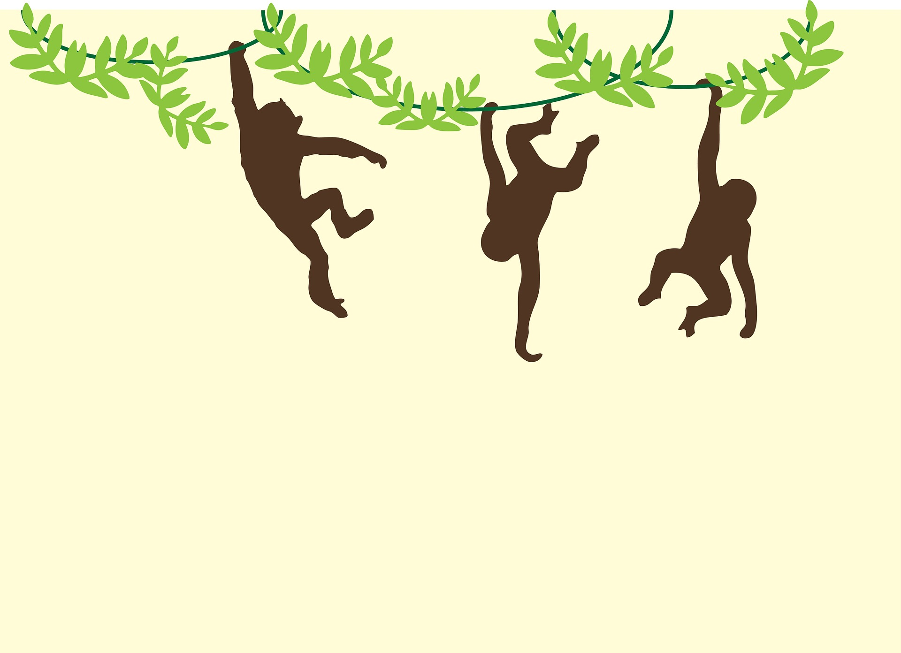

```{r setup, include=FALSE}
knitr::opts_chunk$set(echo = FALSE)
```




Link of the site:

* [article](https://www.sciencedaily.com/releases/2020/08/200818142111.htm)

***

## **Vocabulary**

Words          |Definition                               |Synonym
---------------|-----------------------------------------|-------------
*Courtesy of*|Generosity and cooperation to achieve something.|favor, service, indulgence
*A range*|A series of things, people, etc. Space where animals can circulate in autonomy and natural region of life for certain species.|pasturage
*Range maps*|/|/
*The ceiling*|Limit prescribed by certain conditions.|limit
*An assumption*|Supposition of something by fact, observation,...|supposition 
*For instance*|Series of events or situations that could be part of a process.|example
*To rest in shade*|Sit down to relax in a corner of shadow.|/
*Food supply*|A certain amount of food.|/
*Entirely*|/|completely
*Threshold*|/|limit
*Sustainability*|More sustainable lifestyle.|defendable, maintainable
*To be aware*|/|to be conscious
*The struggle*|Face and resist certain situations.| fight


## **Analysis table**

**Analysis points**   |
----------------------|-------------------------------------------------
*Researchers*         |Concordia University, Patrick Lejtenyi, Stewart
*Published in / when* |August 18, 2020 on Science News
*General topic*       |The impact of global warming on primate life and habitat
*What was examined?*  |The point of climate change put forward here is global warming. Stewart’s research studies the link between temperature rise and the amount of CO2 rejected. After that, she compares current and pre-industrial temperature data to see the impact of this change on a list of 426 primate species and subspecies . This list includes data on the lives of these primates but also on their habitat. 
*Conclusion*       |It has been observed that global warming encurages individuals to protect themselves from high temperatures, which has an impact on their diet, their social life or their reproductive cycle. There is therefore a link between the importance of the impact on the environment and the species that live there. 
