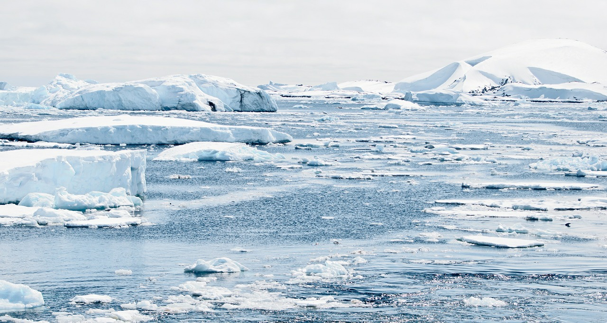

```{r setup, include=FALSE}
knitr::opts_chunk$set(echo = FALSE)
```



Link of the site:

* [article](https://www.sciencedaily.com/releases/2020/09/200911093012.htm )

***

## **Vocabulary**

Words          |Definition                               |Synonym
---------------|-----------------------------------------|-------------
*A clue*|Something that guides through an intricate procedure.|hint
*Prey*|An animal taken by a predator as food.|chase
*Rates*|A quantity, amount, or degree of something measured per unit of something else, estimation relative condition or quality.|grade
*Fierce*|Violently hostile or aggressive in temperament, wild or menacing in appearance.|ferocious
*Wasps*|Any of numerous social or solitary winged hymenopterous insects (especially families Sphecidae and Vespidae) that usually have a slender smooth body with the abdomen attached by a narrow stalk, well-developed wings, biting mouthparts, and in the females and workers an often formidable sting, and that are largely carnivorous and often provision their nests with insects or spiders killed or paralyzed by stinging for their larvae to feed on, any of various hymenopterous insects (such as a chalcid or ichneumon wasp) other than wasps with larvae that are parasitic on other arthropods.|/
*Flies*|Any of a large order (Diptera) of winged or rarely wingless insects (such as the housefly, mosquito, or gnat) that have the anterior wings functional, the posterior wings reduced to halteres, and segmented often headless, eyeless, and legless larvae.|/
*Hosts*|A living animal or plant on or in which a parasite lives.|/
*Preying*|To seize and devour prey, to have an injurious, destructive, or wasting effect.|chase
*Cunning*|Dexterous or crafty in the use of special resources, characterized by wiliness.|crafty
*Greedy*|Having a strong desire for food or drink.|acquisitive
*Skillfully*|Possessed of or displaying skill.|adroit
*Hatch*|To emerge from an egg, chrysalis, or pupa.|incubate
*Sheltered*|To constitute or provide a shelter for.|asylum
*Frost*|The process of freezing.|hoar
*Harnessed*|To tie together.|exploit
*Counterparts*|One remarkably similar to another, one having the same function or characteristics as another.|coequal
*Breakthroughs*|An act or instance of moving through or beyond an obstacle, a sudden advance especially in knowledge or technique.|advance
*Slightly*|Deficient in weight, solidity, or importance, small of its kind.|debilitated
*Crops*|A plant or animal or plant or animal product that can be grown and harvested extensively for profit or subsistence.|harvest


## **Analysis table**

**Analysis points**   |
----------------------|-------------------------------------------------
*Researchers*         |University of Helsinki, Swedish University of Agricultural Sciences, Professor Tomas Roslin, Tuomas Kankaanpää 
*Published in / when* |September 11, 2020 on Science News
*General topic*       |Impact of climate change on a big predator of the Arctic: parasitoides
*What was examined?*  |The Arctic is the best place, according to the researchers, to study the impact of climate change since the climate is relatively cold and the summer periods are very small. The organisms that live there are therefore more sensitive to the slightest change in their environment. This study was conducted on a large group of predators that are parasites. They are more or less impacted by this change depending on their lifestyle through their hosts because parasites use different hosts to reproduce and develop or feed.
*Conclusion*       |The impact of climate change on different hosts affects the parasites that use them to live. These are classified into different groups according to their lifestyle and therefore how they are impacted. For the study, the researchers used a climate change sensitivity barometer that allowed them to develop several solutions. To do this, researchers have to work in collaboration with other scientists for practical, economic and other purposes. Parasites are important organisms to our ecosystem, so it is important to preserve them.
