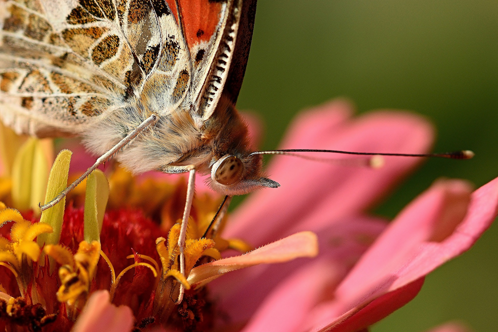

```{r setup, include=FALSE}
knitr::opts_chunk$set(echo = FALSE)
```



Link of the site:

* [article](https://www.sciencedaily.com/releases/2020/09/200924082713.htm)

***

## **Vocabulary**

Words          |Definition                               |Synonym
---------------|-----------------------------------------|-------------
*Shady*|Places where there is shade and which protects from the sun’s ray.|Shadowy
*To buffer themselves*|To mitigate shocks and protect oneself.|Protect themselves
*The sun’s heat*|/|The warmth of the sun
*A shade patch*|A small, distinct area in the shade.|/
*Is compounding*|Add something that can make negative.|Amplify (worse in this case)
*Globally*|Which involves and concerns the whole world.|All around the world
*Features*|A particular part or proeminent characteristic.|Characteristic
*Hedgerow*|A row small trees enclosing fields.|/
*Ditches*|A long narrow excavation dug in the earth.|Fosse
*Hillside*|A part of hill between the top and the foot.|/
*Hand-hell nets*|A net that can be held by hand.|/
*A probe*|A small object that is inserted into something so as to test conditions at a given point.|Research
*Requirement*|Something essential to the existence of someting else.|Condition
*Shrinking*|To become smaller or compacted.|Compress
*Gateway*|An opening for a gate.|Bridge


## **Analysis table**

**Analysis points**   |
----------------------|-------------------------------------------------
*Researchers*         |Univeristy of Cambridge, Andrew Bladon and Dr Ed Turner
*Published in / when* |September 24, 2020 on the university of Cambridge website
*General topic*       |The impact of climate change on butterflies species and temperature.
*What was examined?*  |We now know that some butterfly species can control their body temperature more easily than others by reflecting the sun’s rays. They are ectotherms. Some butterfly species are adapted to places where the temperature variation is not too great, which allows them to better regulate theirs and survive: a micro-climate. Various causes cause the disappearance of these micro-climates and, with them,the decline of the species that inhabit them. However, climate change is worsening the situation. The researchers looked at the impact of these large temperature variations and the more extreme weather caused by climate change on butterflies by studying their body temperature.
*Conclusion*       |Butterflies are important because they are pollinators like bees but they are also a source of food for many other animals. Their decline therefore causes an imbalance within our ecosystem. The study showed that many species no longer agree with their microclimate in terms of temperature. To protect them, it is therefore important to preserve their habitats but also and especially their temperature.
