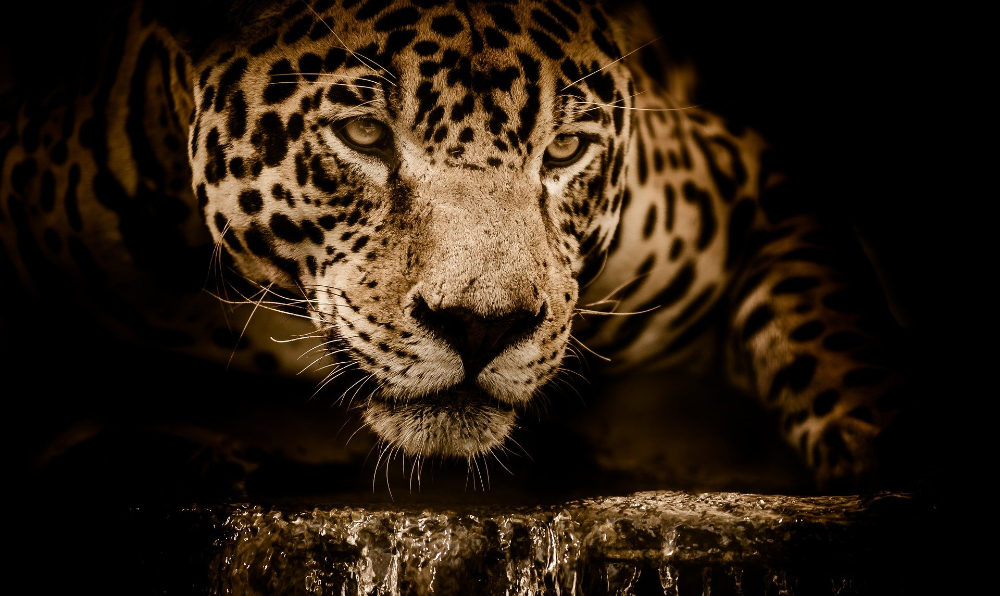

```{r setup, include=FALSE}
knitr::opts_chunk$set(echo = FALSE)
```



link of the site:
*[article](https://www.sciencedaily.com/releases/2020/11/201130101243.htm)

***

## **Vocabulary**

Words          |Definition                               |Synonym
---------------|-----------------------------------------|-------------
*Cope*|Attempt to overcome problems and difficulties.|Manage 
*Near-threatened*|Almost in danger.| /
*Stochastic*|Involving a random variable.| / 
*Tailed*|Animal’s tail.| / 
*Drought*|A period of dryness especially when prolonged.|Lack of water
*Flood*|A rising and overflowing of a body of water espacially on to normally dry land.| Inundation 
*Farmework*|A basic conceptional structure.|Cadre
*Cryptic*|Using to conceal like a cryptic coloration in animals.|Mysterious
*Gathered*|To bring together.|Collect
*Cubs*|A young mammal.|Babe
*Hunting*|The act of one  that hunts specifically.| /
*Starvation*|An instance of starving.| /


## **Analysis table**

**Analysis points**   |
----------------------|-------------------------------------------------
*Researchers*         |University of Technology, Professor Kerrie Mengersen and Professor Kevin Burrage
*Published in / when* |Novembre 30, 2020 in the University Of Technology website
*General topic*       |The impact of climate change (extreme weather events) on the jaguars.
*What was examined?*  |The researchers conducted a study on the situation of jaguars in the nature reserve “Pacaya Semirica Reserve” in Peru. For this, they analysed several points concerning the population of this feline and they linger over their prey (Peccary, Deer, Agouti,Paca and Armadillo). Thanks to this study and the data collected, they counted six population scenarios.
*Conclusion*          |Climate change causes an increase in weather events such as droughts and floods. The researchers showed that jaguars can adapt to this change in the short-term. But these are indirectly impacted because their prey is the most sensitive. In conclusion, the worst case scenario shows that over the long-term, climate change exacerbated by human activity will cause the decline of these animals: prey and predators.

