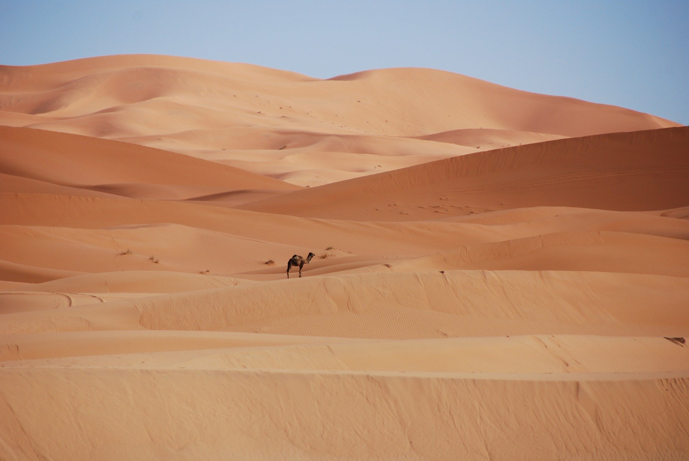

```{r setup, include=FALSE}
knitr::opts_chunk$set(echo = FALSE)
```



Link of the site:

* [article](https://www.sciencedaily.com/releases/2021/02/210204143218.htm)

***

## **Vocabulary**

Words          |Definition                               |Synonym
---------------|-----------------------------------------|-------------
*Burrow*|A hole in the ground made by an animal for shelter and habitation.|House
*Squirrel*|Small rodent living in trees.|/
*Are weathering*|Dealing with something.|Resist
*Triggered*|Released or set off by trigger and occurring in response to a stimulus typically perceived as negative.|Initiated
*Searing*|Very hot.|Boiling
*Blazing*|Burning intensely.|Ardent
*Harsh*|Physically unpleasant and difficult to accept or experience.|Hard
*Glimpse*|To get a brief look at something.|Glance
*Allowing*|/|Permit
*Shifting*|To change place, position or other.|Dislocate
*Breed*|To produce by hatching or gestation.|Procreate
*Threatened*|Having an uncertain chance of survival.|/
*Figuring*|Represent by numeral.|Determine
*Survey*|To examine as to condition or situation and to query in order to collect data for the analysis of some aspect of a group or area.|Examination
*Features*|A prominent part or characteristic.|Characteristic
*Pinpoint*|To fix, determine or identify with precision.|Identify
*Stream / Creek*|A natural stream of water normally smaller than a river.|Brook
*Sampled*|A finite part of a statistical population whose properties are studied to gain information about the whole.|Selection
*The mouth*|The place where a stream enters a larger body of water.|/
*Trickier*|Giving a deceptive impression of easiness, simplicity and requiring skill or caution.|Delicate
*Hiding*|To put out of sight for shelter or protection.|Conceal
*Rely*|To be dependent.|Depend
*Curator*|one who has the care and superintendence of something especially: one in charge of a museum, zoo, or other place of exhibit.|/
*Fieldworker*|Work done in the field to gain practical experience and knowledge through firsthand observation.|/
*Sandy*|Consisting of or containing sand.|/
*Tricks*|A quick or artful way of getting a result.|Artifice
*Sweat*|To excrete moisture in visible quantities through the openings of the sweat glands.|/
*Panting*|To breathe quickly or in a labored manner.|Gasp
*Soar*|To fly aloft or about.|Uprise
*Springs*|The beginning of something.|Source
*Parched*|Deprived of natural moisture.|/
*Dens*|A hallow or cavern used especially as a hideout.|Burrow
*Loads*|The quantity that can be carried at one time by a specified means.|Burden
*Thick*|Having relatively great depth.|Chunky
*Feathers*|Any of the light, horny, epidermal outgrowths that form the external covering of the body of birds.|/
*Skin*|The integument of an animal separated from the body usually with its hair or feathers.|Shell


## **Analysis table**

**Analysis points**   |
----------------------|-------------------------------------------------
*Researchers*         |University of California-Berkeley, Professor Steven Beissinger, Eric Riddell, Lori Hargrove and James Patton
*Published in / when* |February 4, 2021 in the university of California - Berkeley website
*General topic*       |The impact of the climate change on birds and small mammals who live in the desert
*What was examined?*  |At the beginning of the 20th century, the Grinnell Resurvey Project analysed the impact of global warming on animal species living in the desert. Some researchers decided to follow up on this study to see how birds and small mammals adapt to his climate and ecological change in the Mojave Desert (in Southern California and Nevada). Current researchers have continued to work on the project with modern research instruments to compare the data collected in the field at the beginning of the 20th century and today. To do this, they analysed the different species of birds and mammals present on a well-defined terrain through the identification of their sounds and small traps arranged in strategic locations. This required a good knowledge of the field. They also looked at the different methods of physical and psychological adaptation that animals use to cope with heat and regulate their body temperature.
*Conclusion*          |Analyses and comparisons showed that birds and mammals in the same region react differently to rising temperatures and high drought conditions in the desert. The recorded data showed that the temperature in the California desert increased by two degrees and that precipitation decreased by almost 10-20%. The simulations proved that birds had more difficulty coping with the increase in temperature than small mammals. This is due to the possibility that mammals have to hide underground to protect themselves easily from temperature as well as to be more active at night. Because of all this, we have noticed since the beginning of the 20th century and first version of the project, a decline in the population of birds living in the desert. We can also imagine that one in six animal species could be at risk in the future due to climate change. The animals have also developed several physical strategies during the evolution to protect themselves and regulate their body temperature such as feathers or fur, which have made it possible, through simulations, to understand the ease of adaptation of mammals. However, desert species have a certain tolerance for temperature and aridity. The slightest increase in temperature or environmental variation due to climate change can have a significant impact on these animals and cause a cascading reaction on all fauna and flora.

