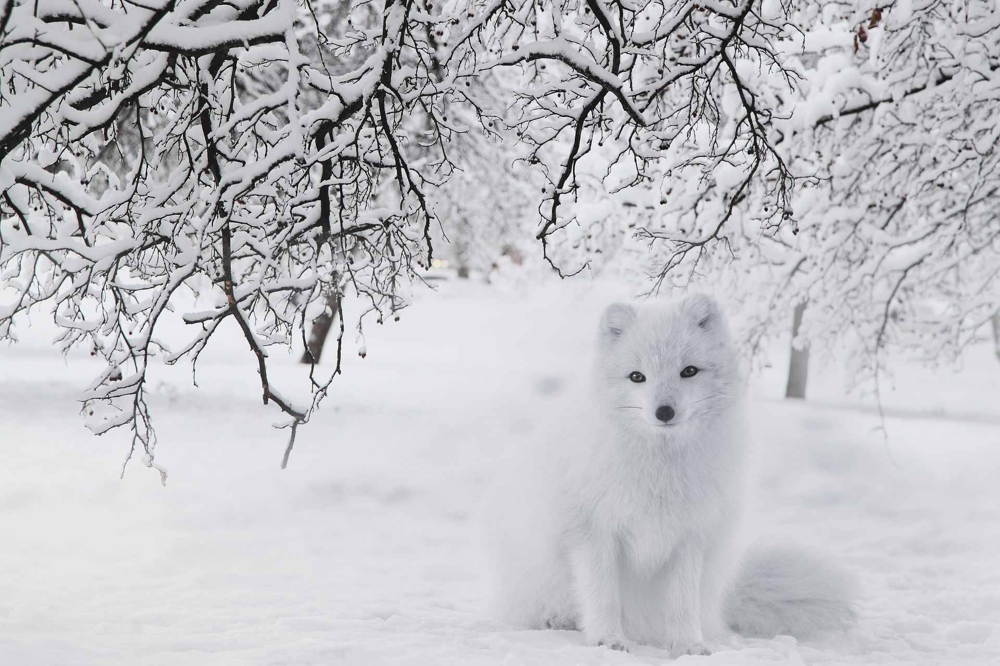

```{r setup, include=FALSE}
knitr::opts_chunk$set(echo = FALSE)
```



Link of the site:

* [article](https://www.sciencedaily.com/releases/2021/03/210316093429.htm)

***

## **Vocabulary**

Words          |Definition                               |Synonym
---------------|-----------------------------------------|-------------
*Breakage*|The action or an instance of breaking.|/
*Wear*|Being damaged.|Break
*Thawing*|To go from frozen to a  liquid state.|Deliquesce
*Depletion*|To lessen in quantity, power or value.|Consume
*Lemmings*|Any of various small short-tailed furry-footed rodents of circumpolar distribution that are notable for population fluctuations and recurrent mass migrations.|/
*Voles*|Small rodents that typically have a stout body, rather blunt nose, and short ears, inhabit both moist meadows and dry uplands and do much damage to crops, and are closely related to muskrats and lemmings.|/
*Bust*|To break or smash especially with force.|Break
*Ptarmigans*|Grouses of northern regions with completely feathered feet.|/
*Hares*|Gnawing, herbivorous mammals that have long ears, short tails, and powerful long hind legs, are usually solitary or sometimes live in pairs, have the young open-eyed and furred at birth, and live in aboveground nests.|/
*Scavenged*|To remove from an area.|/
*Reindeer*|/|Caribou
*Pitting*|The action or process of forming pits.|/
*Flagship*|The finest, largest, or most important one of a group of things, often used before another noun.|/
*Harvesting*|The season for gathering in agricultural crops.|Corps 


## **Analysis table**

**Analysis points**   |
----------------------|-------------------------------------------------
*Researchers*         |Peter Ungar (leader), Alexandria Peterson, Blaire Van Valkenburgh, Dorothee Ehrich, Oliver Gilg, Alexandra Terekhina, Alexander Volkovitskiy, Aleksandr Sokolov, Natalia Sokolova, Ivan Fufachev and Viktor Shtro.
*Published in / when* |March 16, 2021 on the University of Arkansas website.
*General topic*       |Study of climate change in arctic regions through the dentition of polar fox.
*What was examined?*  |The aim of the research was to analyze the diet of polar foxes through the analysis of the different splinters and usures of their teeth. Using this data, the researchers were able to see indirectly the effects of climate change at different times at the Arctic Circle level on the more sensitive animals in this diet. Indeed, the diet analyzed over a long period makes it possible to understand the different adaptations of the fox in order to find food according to the abundance of prey, the seasons but also the climate. The studies are carried out on nearly 78 individuals in the Arctic North and more precisely on the different marks by the bones of their prey on their teeth.
*Conclusion*          |The different data were able to accurately demonstrate the type of feeding of polar fox over the long term and in various regions. It has been proven that these animals adapt their diet according to the abundance of rodents present in relation to the regions. Thanks to this, the researchers were able to define the negative impact of climate change and therefore environmental change on the abundance  of animals and the adaptation of polar foxes.

