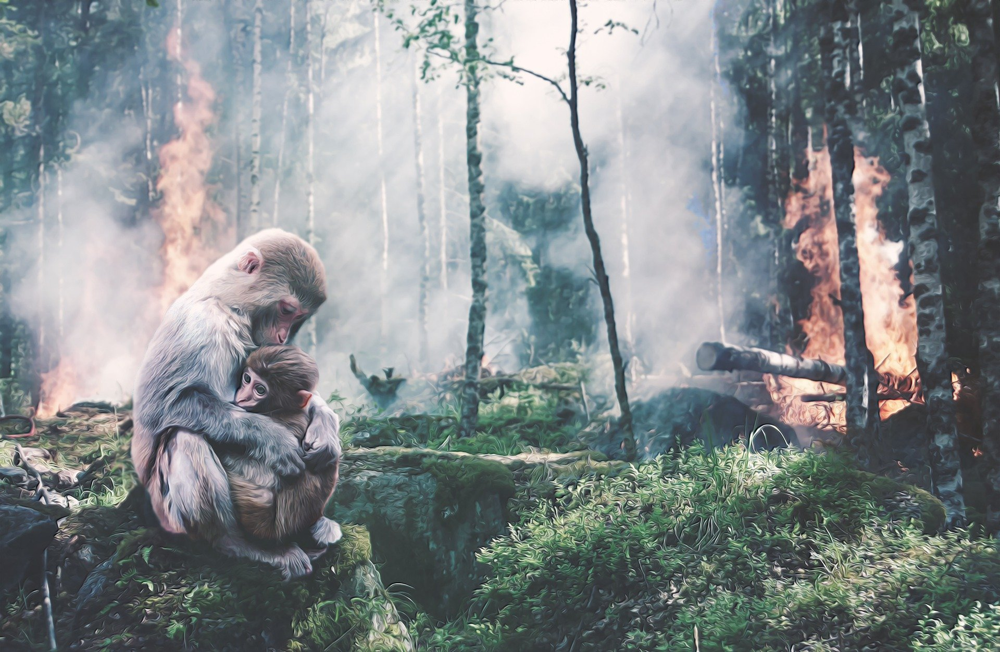

```{r setup, include=FALSE}
knitr::opts_chunk$set(echo = FALSE)
```



Link of the site:

* [article](https://www.sciencedaily.com/releases/2021/01/210121130827.htm)

***

## **Vocabulary**

Words          |Definition                               |Synonym
---------------|-----------------------------------------|-------------
*Sever*|Strongly critical or condemnatory.|Austere
*The all-clear*|An indication that a situation is no longer dangerous.|/
*Closely*|Being near in time, space or effect and very precise and attentive to details.|Compact
*Forecasts*|A prophecy, estimate, or prediction of a future happening or condition.|Prediction


## **Analysis table**

**Analysis points**   |
----------------------|-------------------------------------------------
*Researchers*         |Dr Manuel Steinbauer, Gregor Mathes M. Sc.
*Published in / when* |January 21, 2021 on the University of Boyreuth website.
*General topic*       |Impact of past climate change to date on all of Earth’s biodiversity.
*What was examined?*  |The aim of the research was to analyse different data collected in the field for a maximum of living species on Earth in all environments. Using this data and paleo-biological analyses, the researchers were able to determine the impact of climate change under various conditions on animals.
*Conclusion*          |The conclusion is that over time, different species have found the possibility of adapting to these (sometimes large) variations in temperature and climate change. However, these animals are not protected from change in their natural habitat and are even in danger of extinction. Here, human beings have a large share of responsibility because their excessive activity combined with climate change aggravates environmental conditions and accelerates the degradation of ecosystems and therefore of biodiversity.

