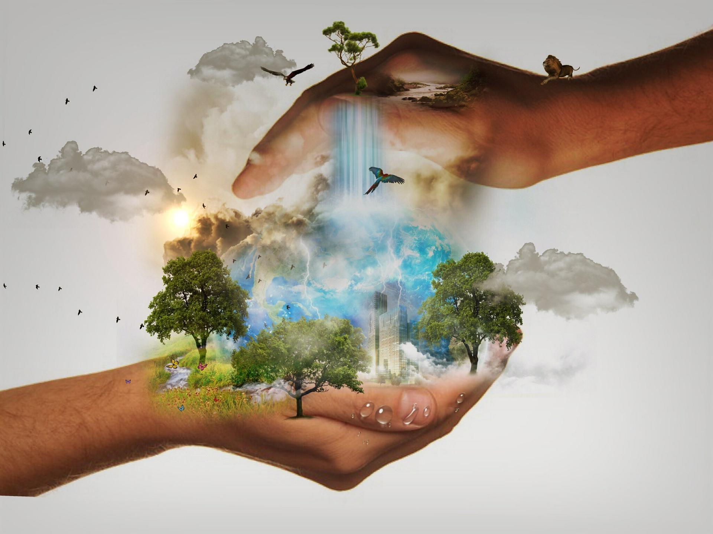

```{r setup, include=FALSE}
knitr::opts_chunk$set(echo = FALSE)
```



***

After an analysis of the various articles based on extensive studies of the subject, it can be clearly said that climate change has a very negative impact on living beings, in this case: lands animals. 
Despite their ability to adapt, some animals or groups of animals are even in decline and in danger of extinction due to global warming and stronger weather conditions. The increase in temperature is an important point that affects animals’ species. In addition, some are less resistant to the various changes that this increase can cause such as butterflies that have the ability to adapt their body temperature under a certain limit. Impacts can be direct or indirect. Predators, for example, are indirectly impacted by climate change through their more fragile and sensitive prey habitat. Many small animals are heavily affected: parasites living in the Arctic are changing their lifestyles, as are the organisms that make up biomass at field level. 
Climate change is visible everywhere far away but also close to home, all living beings are impacted like human beings. We also have our share of responsibility because these typically human intensive activities aggravate these already present climate change. However, the various studies have shown us that we will also be affected because all life is linked. 
