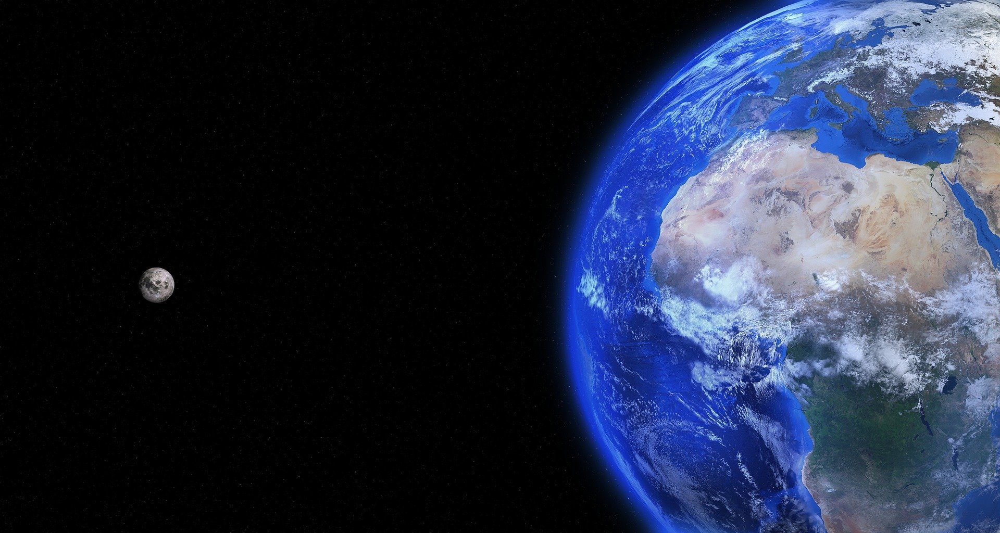

```{r setup, include=FALSE}
knitr::opts_chunk$set(echo = FALSE)
```



***

For several years, climate change has been at the heart of our current events and our thoughts. We all hear about global warming, stronger weather events than before: we are witnessing everywhere the fires that ravage the forests, the more violent hurricanes, floods, etc.We know that climate change today has a fairly significant impact on our planet that results from a variety of consequences that are visible at many scales. The point discussed here will be the impact of climate change on land animals. From the most microscopic animal to our mammalian cousins, each one is affected differently to these changes but at what level? Many researchers have asked the question, and many have made it a research project.  They have traveled the world, analysed data sometimes over several years to try to understand how animals are coping with rising temperatures, more intense drought periods and other. 
Climate change is often seen as an environmental problem only, and when we think about the consequences, we often imagine extreme case such as melting ice at the poles or great droughts in Africa because these are the most visible and striking impacts. 
However, through various articles, it is clear that climate change is felt much closer to us than we think, and every living being is affected. 
I chose this topic because, on the one hand, it is a current event that everyone is talking about and that seems to be affecting more and more people and, on the other hand, because it is something that touches me. We all face this problem, but we do not know exactly what impacts climate change can have. If we want to solve this problem as some people want, we need to know. 


